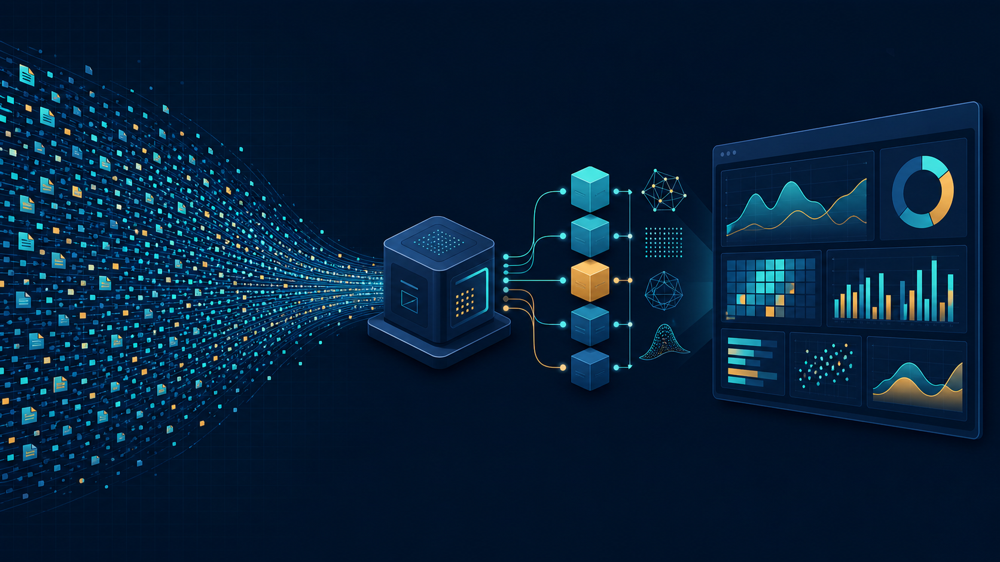
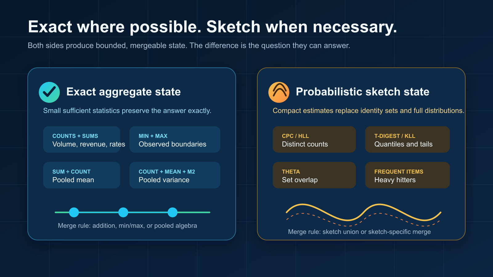
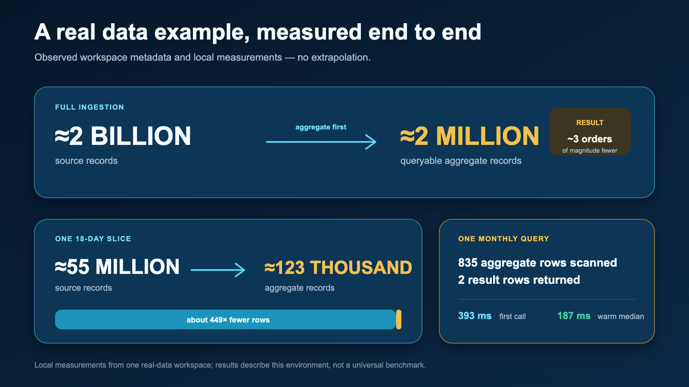
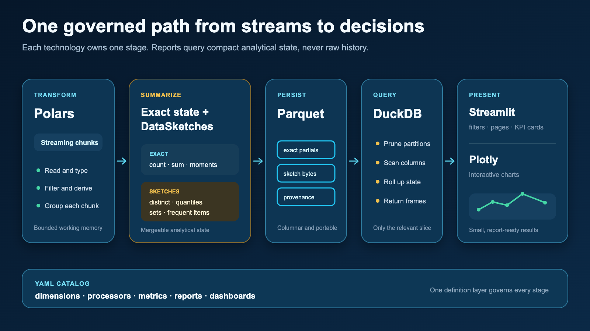

# From Streams to Decisions, Part 1: Don’t Store Every Event

*How aggregate-first processing and mergeable sketches turn a continuous stream of events into a compact dataset that stays useful, queryable, and fast on modest hardware.*

The open-source implementation discussed here is available on [GitHub](https://github.com/grishasen/value_stream_v2).

*Keep the information needed for decisions, not an indefinite copy of every event.*

Most analytics architectures begin with an apparently harmless assumption: retain the raw events now and decide what to calculate later. That is sensible when storage, processing capacity, and operational attention are plentiful. It is much less attractive when data arrives continuously and the reporting system must run on a laptop, an edge machine, or a small server.

The alternative is not to stop asking useful questions. It is to decide which information those questions require and update that information while the stream is being read. Counts, sums, minima, maxima, means, variances, distributions, distinct populations, and set relationships can all be represented as compact state. Raw rows can then disappear after their contribution has been recorded.

> The unit of persistence is no longer the event. It is the smallest mergeable state that can still answer the intended question.

This is the central idea behind aggregate-first analytics. It changes the system from a warehouse of past events into a continuously maintained model of what those events mean.

## Reporting on a stream is a state-management problem

A dashboard does not usually need to replay every historical event. It needs current and historical states: orders per day, revenue by channel, latency percentiles by service, distinct customers per region, conversion rates by campaign, or overlaps between two populations.

Each incoming chunk can therefore be reduced immediately. Exact measures are updated with algebraic state—for example, a count and a sum. Questions that would otherwise require unbounded memory are updated with a sketch. Both kinds of state are grouped by the dimensions that matter to the business and persisted with their time window and provenance.

This design has three practical consequences:

- Memory use is bounded by the chunk and the aggregate state, rather than total history.
- Processing can be deterministic and repeatable because each chunk produces mergeable partials.
- Reports query a compact analytical dataset instead of scanning the original stream.

It also creates a discipline that traditional “store everything” systems can postpone: dimensions, metrics, time grain, and acceptable error must be explicit before ingestion. That discipline is a feature. It connects reporting requirements directly to the data structures the system maintains.

## Exact aggregation: compressing without approximation

Many measures can remain exact even when the raw rows are discarded. A count is a number. A sum is a number. A minimum and maximum each require one value. A mean can be reconstructed from a sum and count. A variance can be maintained with a mergeable statistical state.

Imagine events grouped by day, product, region, and channel. Instead of keeping every event, the processor stores one state per observed combination of those fields. A report asking for a month can merge the daily states. A report asking for all channels can roll up the channel dimension. The stored result remains exact for the configured measure.

The important word is *configured*. Once a dimension has been omitted from the aggregate key, it cannot be recovered later. Aggregate-first systems trade open-ended forensic freedom for predictable cost and fast answers to defined questions. The trade is often excellent for operational reporting, embedded analytics, and repeatable KPI suites.

## When exact values are too expensive, keep a sketch

The most interesting analytical questions are not always reducible to a handful of exact numbers. Consider three common requests:

- How many unique customers did we see?
- What were the median, 95th, and 99th percentile latencies?
- How many users belong to both audience A and audience B?

An exact answer to the first question requires remembering every distinct identifier. Exact percentiles require retaining—or repeatedly sorting—the distribution. Exact set overlap requires materializing both sets. As the stream grows, those structures grow with it.

A sketch is a compact probabilistic summary. It deliberately retains enough information to estimate a property of the data with a known, controllable error profile. Crucially, sketches are mergeable: a sketch created from one period can be combined with a sketch from another period without reading either period’s raw events again.

*Exact aggregates answer algebraic questions; sketches make otherwise unbounded questions practical.*

### Distinct counts

A distinct-count sketch hashes each identifier and updates a compact statistical state. The state does not contain a recoverable list of customers; it contains evidence from which cardinality can be estimated. Its memory is governed mainly by the configured precision, not by whether the stream contains one million or one billion events.

This is a better contract than it may first appear. A dashboard usually needs to know whether the active population is approximately 98 million or 103 million. It rarely needs to enumerate every identifier merely to display that number. The sketch aligns storage with the actual question.

### Quantiles and percentiles

A quantile sketch summarizes the shape and rank order of a distribution. It can estimate the median, tail percentiles, a cumulative distribution, or approximate histogram boundaries without retaining every observation.

The error is naturally expressed in rank. For a requested 95th percentile, the returned value may correspond to a nearby rank within the sketch’s documented error bound. That is usually more honest than presenting a tail percentile with many decimal places while ignoring sampling noise, instrumentation error, and changing traffic.

### Sets, intersections, and similarity

Set sketches support population questions that are expensive with exact identifiers: union, intersection, difference, containment, and similarity. This is useful for audience analysis, repeat behavior, feature adoption, and funnel comparisons. Partial sketches can be merged across chunks, dates, or partitions, which makes them a natural fit for streaming ingestion.

### Approximation is a product decision

“Approximate” should never mean “mysterious.” A useful metric definition states which algorithm is used, which precision or capacity parameter controls it, and how the result should be interpreted. Reports should distinguish estimated measures from exact ones and, where useful, expose bounds or accuracy metadata.

It is also worth separating questions by consequence. Financial settlement, compliance totals, and contractual billing may require exact arithmetic. Audience size, operational percentiles, and behavioral overlap are often ideal sketch workloads. A single report can combine both.

| Question | Stored state | Result |
|---|---|---|
| How many events? | Counter | Exact |
| What is total value? | Sum | Exact |
| How many unique entities? | Distinct-count sketch | Estimate with bounded error |
| What is the 99th percentile? | Quantile sketch | Rank estimate |
| How much do populations overlap? | Set sketch | Estimated set operation |

## A real-data example: from two billion rows to a queryable model

This example comes from a large real-data workspace used to exercise the full reporting path. These are observed values, not a hypothetical benchmark.

Its catalog defines 10 primary business dimensions. Across the configured processors, there are 22 group-by fields, 11 processor instances in five processor families, and 128 metrics across 12 calculation families. The reporting layer contains four dashboards, 17 pages, and 163 tiles.

About two billion source records became about two million queryable aggregate records.

The aggregate directory occupied about 16 GB on that machine. That figure needs context: the directory also retained physical partials from multiple runs, so it is not a clean “compressed output size” measurement. It is an honest reading of the workspace as it existed.

*In one real-data example, roughly two billion source rows became roughly two million queryable aggregate records.*

An 18-day slice makes the reduction easier to picture. About 55 million source rows became about 123 thousand aggregate records—roughly 449× fewer rows to scan, filter, merge, and visualize.

For one monthly click-through-rate query, the query layer scanned 835 relevant aggregate records and returned two result rows. The first local execution took 393 milliseconds; the median of subsequent warm executions was 187 milliseconds.

A broader engagement overview contained 10 tiles—six KPI cards and four charts. A server-side Streamlit application test rendered that page in 14.6 seconds from a cold start, with a 1.49-second median across warm reruns. That measurement includes Python-side query and chart construction but not browser paint, so it should be read as an application benchmark rather than a universal page-load claim.

The point is not that every workload will produce the same ratio or timing. Cardinality, dimensions, metric families, hardware, and storage all matter. The point is that billions of source events do not require billions of persisted report rows. Once events become mergeable analytical state, ordinary hardware can answer useful questions from a much smaller surface.

## How the technical stack works together

The implementation combines specialized tools instead of asking one engine to do everything.

*Each library owns a clear stage: transform, summarize, persist, query, present, and visualize.*

**Polars** reads and transforms incoming chunks with a columnar, expression-based execution model. It handles typed projections, filtering, derived dimensions, and exact grouped aggregation efficiently without requiring the entire input history in memory.

**Apache DataSketches** supplies compact, mergeable probabilistic structures for questions such as distinct counts, quantiles, frequencies, and set operations. Sketch bytes travel beside exact aggregate state, using the same dimensions, time windows, and provenance.

**Parquet** persists aggregate and sketch partials in a portable columnar format. Raw input rows do not need to survive chunk processing; the durable artifacts are the states required to reproduce report results.

**DuckDB** is the local analytical query layer. It scans the relevant Parquet partitions, applies report filters, rolls up exact measures, and returns sketch payloads for final merging or estimation. Because the persisted dataset is already aggregate-first, DuckDB works over a far smaller surface than the source stream.

**Streamlit** turns the catalog into an interactive reporting application: page navigation, filters, KPI cards, report composition, and cached execution. It is the delivery layer rather than the place where metric semantics are invented.

**Plotly** renders the returned report frames as interactive charts. It receives small, presentation-ready results rather than raw events, which keeps chart construction separated from ingestion and metric computation.

Together, the flow is straightforward: Polars reduces each chunk; exact aggregators and DataSketches update mergeable state; Parquet preserves those states; DuckDB selects and rolls them up; Streamlit coordinates the report; and Plotly presents it. A YAML catalog connects the stages by defining dimensions, processors, metrics, reports, and dashboards.

## What aggregate-first design does—and does not—promise

This approach is powerful, but it is not a magical compression button.

- It promises bounded processing over chunks, provided processors do not retain raw history.
- It promises mergeable results when metric state and sketch configuration are compatible.
- It promises query cost proportional to relevant aggregates, not total source events.
- It does not promise arbitrary future questions about dimensions that were never retained.
- It does not make approximation appropriate for measures that require exact accounting.
- It does not remove the need for provenance, configuration hashes, validation, and idempotent ingestion.

Those boundaries are useful. They make the architecture legible: business questions become metric definitions; metric definitions select exact states or sketches; the states become queryable reports; and the reports become dashboards.

## Where the series goes next

This first article described the storage and processing principle. The next two parts should move upward through the model.

1. **Next: Metrics.** How to turn business definitions into exact or approximate calculations; choose dimensions and time grains; define safe ratios; expose sketch accuracy; and test metric behavior.
2. **Then: Reports.** How filters, rollups, time comparison, KPI cards, tables, and charts query the aggregate layer without leaking computation into the UI.

Later articles can cover dashboard composition, deterministic ingestion and recovery, provenance, performance measurement, and the boundary between aggregate-first reporting and systems that must retain raw events.

The guiding question throughout the series will remain the same: what is the smallest durable state that preserves the decision we need to make?

Source, examples, and documentation are available in the [Value Stream GitHub repository](https://github.com/grishasen/value_stream_v2).
