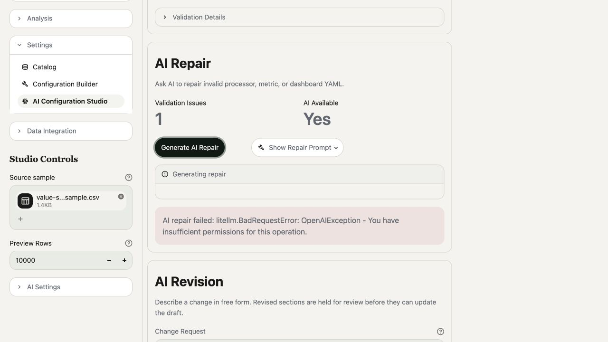
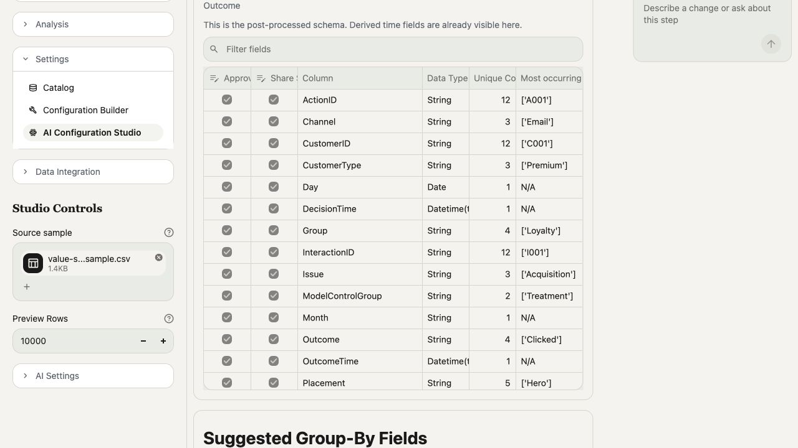
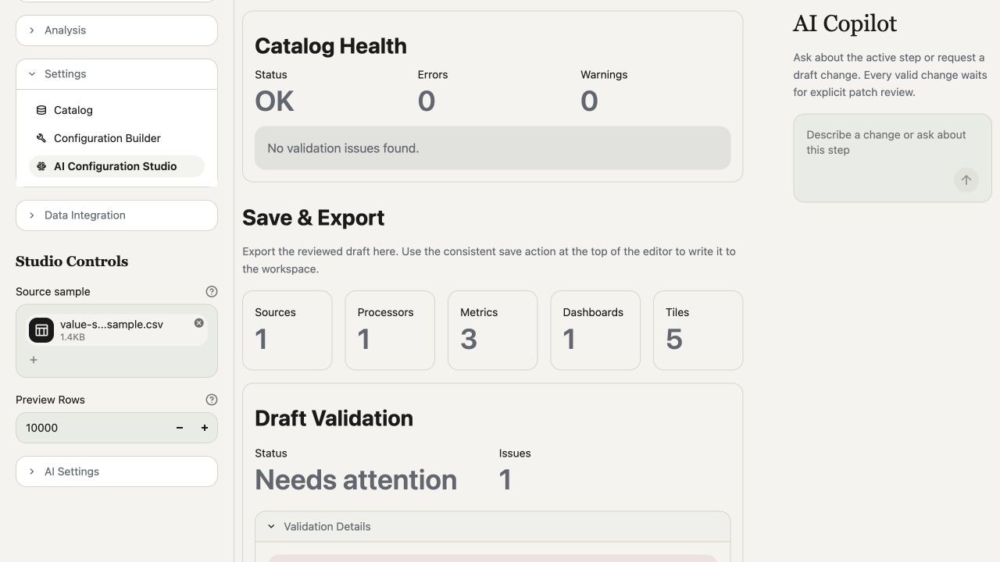
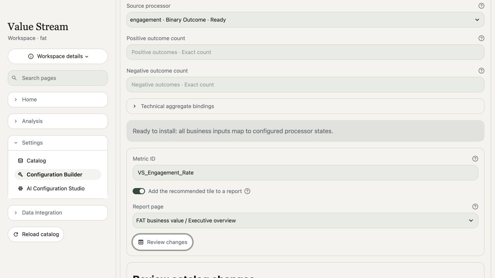
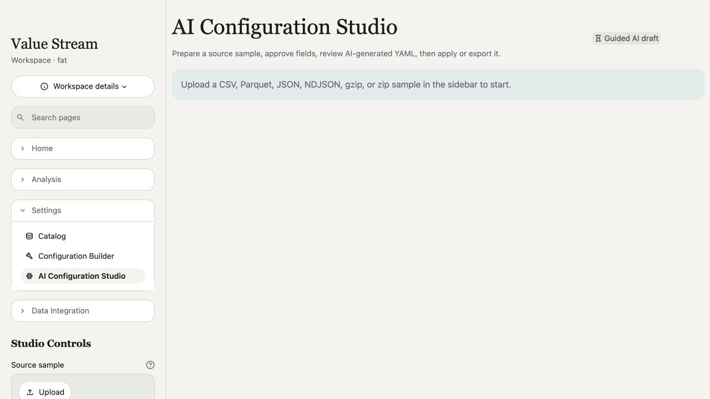
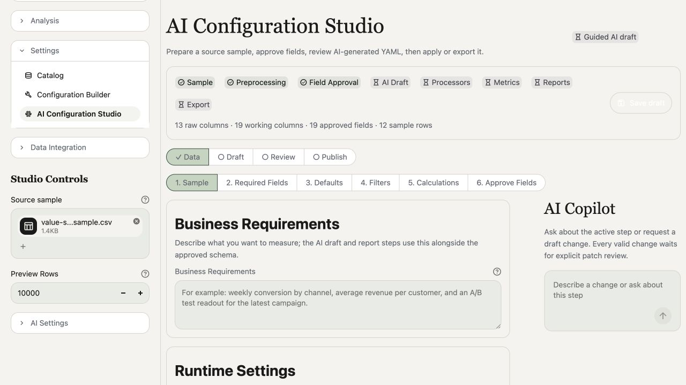
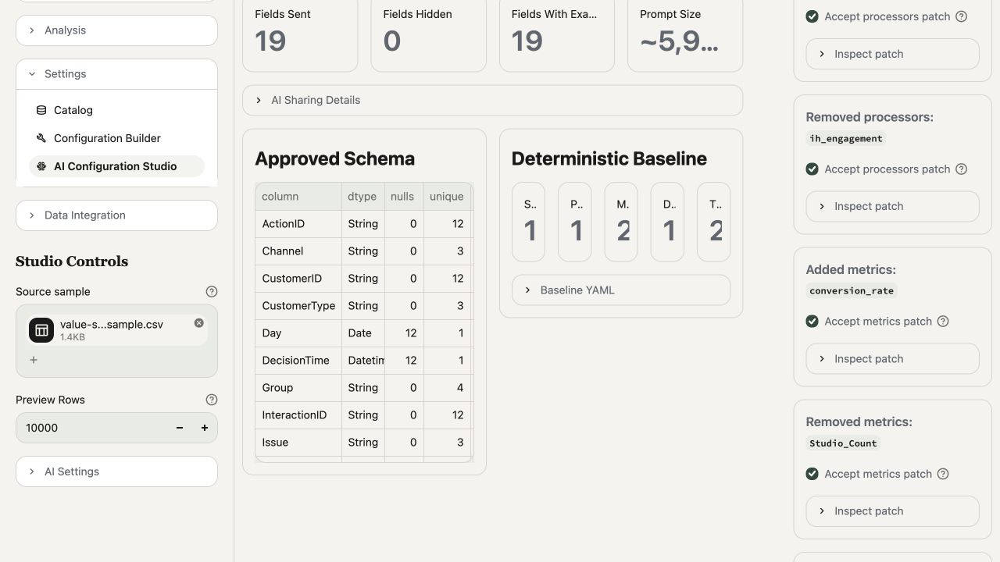

# Configuration Builder + AI Configuration Studio conversion audit

**Date:** 2026-07-17

**Application tested:** local Streamlit app on port 8501, workspace `fat`

**Requested surface:** “Configuration Editor” — the product currently labels it **Configuration Builder** — plus **AI Configuration Studio**
**Method:** two fresh desktop-browser passes: (1) visual/interaction teardown across every visible editor step; (2) a first-time-user activation journey using a synthetic CSV and a real configured AI call. No draft was saved to the workspace and no source run was started.

## Executive verdict

The underlying product is powerful, but the activation experience behaves like an internal administration console. Configuration Builder makes users understand the catalog before it demonstrates value. AI Configuration Studio is worse: its tested happy path automatically enabled field and example sharing for all 19 fields, generated an invalid draft after roughly a minute, advertised AI repair as available, failed that repair for insufficient permissions, and then let the user reach a publish screen that simultaneously said **Catalog Health: OK** and **Draft Validation: Needs attention**.

That is not a polish problem. It is a trust and conversion failure.

| Conversion dimension | Score | Ruthless assessment |
|---|---:|---|
| First-value speed | 2/10 | The first visible outcome is configuration work, not a useful report or validated preview. |
| Trust and safety | 2/10 | Sharing is opt-out, completion states overclaim progress, and validation states contradict one another. |
| Findability | 4/10 | Both creation tools are hidden inside **Settings**, with no explanation of which one to use. |
| Visual hierarchy | 4/10 | The page is a stack of equally weighted cards, pills, help icons, status strips, and raw implementation details. |
| Recovery | 1/10 | The live AI failure exposed a raw provider exception; the advertised repair failed and no guided recovery followed. |
| Expert capability | 8/10 | The catalog coverage, deterministic fallback, YAML escape hatches, and transactional write model are substantial. |

## Critical

### C1. The AI happy path fails at the exact moment the product must earn trust

**Observed in pass 2:** after entering “Show weekly conversion rate and revenue by channel, and compare treatment versus control,” the draft call spent roughly one minute in a generic sending state. The returned patch was preselected for acceptance, but accepting it produced an invalid processor definition at `processors.processors.0.binary_outcome.states.RevenueSum.type`. The UI then said **AI Available: Yes**; the repair call failed with a raw `litellm.BadRequestError` stating that the operation had insufficient permissions.

**Why visitors leave:** the primary promise is “AI creates my configuration.” The first real attempt produced unusable work and proved that the advertised escape hatch was not operational. A buyer will infer that every future failure becomes their debugging problem.

**Fix before driving traffic:**

1. Run a model/auth capability preflight before enabling **Generate AI Draft** or **Generate AI Repair**.
2. Validate and self-correct generated YAML server-side before showing any patch to the user. Invalid patches must never reach the acceptance UI.
3. Replace provider/library exceptions with a product error: selected model, failed capability, one recommended action, and a retry after settings are corrected.
4. Add elapsed progress, a cancel action, and named stages such as “Analyzing schema,” “Building metrics,” and “Validating draft.”

The guide promises a model-specific recovery message for permission failures, but the tested UI exposed the raw exception instead ([guide](../guides/configuration/ai-config-studio.md#ai-copilot)).

### C2. Example sharing is enabled for every field by default

**Observed in both passes:** loading the synthetic sample automatically approved all 19 fields and enabled **Share Sample Values** for all 19. The AI Draft summary confirmed **Fields Sent: 19**, **Fields Hidden: 0**, and **Fields With Examples: 19**. The user did not visit or confirm the approval screen before generation became available.

This is also the implemented default: initial approval copies every available field into both the approved and example-field lists (source: `src/valuestream/ui/pages/ai_config_studio.py:5055`).

**Why visitors leave:** customer IDs, action IDs, outcomes, revenue, and other business data are exactly the fields security-conscious buyers expect a product to minimize. Opt-out sharing creates procurement risk and makes the “Approve Fields” step feel performative.

**Fix before driving traffic:** default sample values to **off**; require an explicit “Review data sent to AI” checkpoint; flag likely identifiers and sensitive fields; show the provider/model and retention statement at the consent moment; send schema names/types by default and examples only per-field by opt-in.

### C3. The product declares the data phase complete before the user reviews the data

**Observed:** immediately after upload, the phase strip marked **Data ✓** even though Required Fields, Defaults, Filters, Calculations, and Approve Fields had not been visited. A deterministic draft then marked Draft and Review complete without the review steps being opened.

The status function equates “approved fields exist” with Data complete and “draft validates” with Review complete (source: `src/valuestream/ui/pages/ai_config_studio.py:308`). It measures machine state, not human completion.

**Why visitors leave:** the checkmarks teach users that the guided review is optional, while the product copy says review is essential. That destroys the meaning of every later success state.

**Fix:** use distinct states: **Not started → Ready to review → Reviewed → Validated → Published**. Only a deliberate user confirmation should produce “Reviewed.” Never use a checkmark for a prerequisite that was silently inferred.

### C4. Publish shows mutually contradictory truth

**Observed in pass 2:** the invalid draft could be taken to Publish. Save & Export showed **Catalog Health: OK / 0 errors / 0 warnings** directly above **Draft Validation: Needs attention / 1 issue**.

**Why visitors leave:** users cannot tell which verdict governs the action. “OK” becomes decorative rather than trustworthy, and a critical safety system starts to look broken.

**Fix:** label the two objects explicitly — **Current workspace** and **Unsaved draft** — and make the page-level verdict the stricter of the two. Disable entry into Publish until the draft is valid, or turn Publish into a blocker-resolution screen with one next action.

### C5. Saving is a three-model maze, and unfinished work can disappear silently

**Observed:**

- Builder step editors write changes directly to workspace catalog files, while its final **Save & Export** step mainly validates and downloads.
- The Builder metric recipe put **Review changes** at the bottom of a long form, then enabled the actual save action back at the top of the page.
- Navigating away discarded that unsaved proposal without a warning.
- AI Studio has **Update … In Draft**, the top **Save draft**, and the lower **Save Draft & Run Source**. Those are three materially different persistence levels with visually similar language.

**Why visitors leave:** users cannot predict whether a click changes the session, files, or data. Silent loss makes them reluctant to experiment; accidental persistence makes them afraid to click.

**Fix:** adopt one visible state model everywhere: **Editing locally → Ready to save → Saved to workspace → Data refresh required**. Put a sticky footer beside the work with **Discard** and one context-specific primary action. Add a dirty-state navigation guard. Rename the ingestion action to **Save configuration and process workspace data** and reserve “Save” for persistence only.

### C6. A generic CSV silently becomes a Pega ZIP source

**Observed:** uploading a normal CSV initialized source ID `ih`, reader `pega_ds_export`, file pattern `**/*.zip`, filename grouping, streaming, and a Pega-style timestamp format. Those defaults are set for every new sample (source: `src/valuestream/ui/pages/ai_config_studio.py:871`) and flow into the deterministic draft (source: `src/valuestream/ui/pages/ai_config_studio.py:4670`).

**Why visitors leave:** the generated configuration does not describe the file they uploaded. A user who trusts the default will save a source that cannot reproduce the preview.

**Fix:** infer reader and file pattern from the sample; present detected assumptions in a one-screen import summary; use neutral IDs; only offer Pega presets when the sample or user choice supports them.

### C7. “Upload” and “Run Source” imply an end-to-end path that does not exist

The upload is read from in-memory bytes for schema preview (source: `src/valuestream/ui/pages/ai_config_studio.py:794`). **Save Draft & Run Source** writes the draft and runs generated workspace sources (source: `src/valuestream/ui/pages/ai_config_studio.py:4924`); it does not persist or ingest the uploaded bytes.

**Why visitors leave:** the most natural mental model is “I uploaded this CSV, so run this CSV.” The product instead asks the newly generated file pattern to find separate workspace data. Unless a separate workspace file already matches that pattern, the likely result is a successful configuration followed by no data.

**Fix:** choose one honest path: either persist the uploaded sample as the first source file with explicit consent, or label it **Preview sample only** at upload and require the user to choose the production data location before the run action is enabled.

### C8. The first AI screen is a dead zone

On a fresh visit, the main canvas contains only an informational sentence telling the user to upload in the sidebar. The uploader is below navigation and outside the focal area. There is no primary CTA, sample dataset, expected outcome, time estimate, or explanation of Builder versus AI Studio.

**Why visitors leave:** the product spends its highest-intent moment making the user hunt for the start button.

**Fix:** put a dominant **Upload a sample** drop zone in the canvas, add **Try with demo data**, promise the output (“validated metrics and a report draft”), state the expected time, and show the three-step journey. Keep the sidebar for secondary settings only.

## High impact

### H1. Core creation tools are hidden under Settings

**Configuration Builder** and **AI Configuration Studio** are both nested under **Settings** (source: `src/valuestream/ui/shell.py:97`). That taxonomy says “administration,” not “create value.” Move them into a top-level **Build** or **Create** section. The first entry should be a single onboarding choice, not two unexplained tools.

### H2. Builder versus AI Studio is an unexplained fork

The names do not tell a first-time user whether the tools are alternatives, stages, or expert/basic modes. Add one launch screen: **Start from my data with AI** and **Configure manually**. Explain what each path produces, what it changes, and who it is for.

### H3. The interface is visually flat despite being structurally dense

Nearly every group is a rounded bordered card with the same weight; nearly every action is a pill; every subsection has a help icon; large serif headings compete with dense operational controls. Nothing visually distinguishes “required to continue” from “advanced” or “read-only.”

Reduce surfaces by at least a third. Use cards only for independently actionable objects, not as generic wrappers. Reserve the filled primary button for the one action that advances the journey. Put advanced YAML and implementation settings behind a clearly labeled expert drawer.

### H4. The permanent Copilot rail steals the space needed for the task

The rail consumes roughly a quarter to a third of the working canvas even when empty. During patch review, long object IDs and accept controls are squeezed into that rail while the main canvas contains large unused areas.

Make Copilot a collapsible drawer. When a patch is pending, promote a full-width diff/review mode with object-level summaries, changed fields, validity, and **Accept all / Review individually / Reject**.

### H5. “Accept” is preselected for destructive structural changes

The generated patch proposed adding and removing processors, removing an existing metric, changing dashboards, and adding tiles. Every acceptance checkbox was already selected. This is the wrong default for AI-authored deletions.

Default additions to unselected or explicitly reviewable; always default removals to **reject**. Summarize consequences in business language: “removes the existing engagement metric from reports” is clearer than an object ID.

### H6. Neither workflow has a dependable guided-navigation rhythm

Builder exposes nine peer pills in one segmented control. AI Studio adds a phase strip and another step strip. There is no persistent **Back / Continue** footer, no visible count, and no single recommended next action. The Builder tutorial still promises Previous/Next actions that the live control does not render ([tutorial](../tutorials/builder.md#before-you-start); implementation: `src/valuestream/ui/pages/config_builder.py:256`).

Use one progress component: **Step 3 of 6**, current task, completion criteria, Back, and one Continue action. Let users jump from a compact outline, not from a dominant row of pills.

### H7. The required-field mapping asks users to type column names

Required fields are mapped through text inputs even though the uploaded schema is known. This creates typo risk at the point where the product should demonstrate intelligence. Use schema-backed searchable selects, show a sample value/type, auto-suggest matches, and validate uniqueness immediately.

### H8. The Builder pushes the primary commit action outside the user's viewport

Metric recipes are long. After **Review changes**, the enabled save action is at the top rather than beside the review. Users must know to scroll back and rediscover a changed control. Use a sticky action bar with a dirty-state summary and keep the commit action adjacent to the generated diff.

### H9. The product exposes implementation detail before outcome

Raw YAML, reader kinds, algorithm/state vocabulary, generated IDs, a repository README, and a raw report inventory are first-class navigation. They are useful escape hatches for experts, but they overwhelm the core job: produce a trustworthy metric and report.

Move README and Report Inventory into **Developer tools**. Default every editor to business language and progressive disclosure. Show generated YAML only after the user asks to inspect it.

### H10. Success stops at configuration, not value

After building a metric or report, the user still has to understand whether a data replay is required, navigate to data loading, run the right source, and find the resulting report. There is no celebratory preview or direct “see your result” path.

The success state should say exactly what was created, whether existing aggregates are sufficient, and offer one primary next action: **Open report** or **Process data**, never both without recommendation.

### H11. Error copy is written for maintainers, not buyers

The live failure displayed `litellm.BadRequestError: OpenAIException`. Other screens expose catalog hashes, raw IDs, and status punctuation. Translate errors into product language, keep diagnostics in a disclosure, preserve the user's work, and attach a one-click recovery.

### H12. Accessibility needs a real interaction audit before launch

The screenshots show low-emphasis disabled controls, dense wrapping segmented controls, and status communicated heavily through `✓`, `!`, and `○`. The inspected DOM did include useful labels, buttons, radios, and help affordances, but screenshots cannot establish keyboard order, focus visibility, screen-reader announcements, contrast ratios, or 200% zoom behavior.

Run dedicated keyboard, screen-reader, zoom, and measured contrast tests. Give statuses full text in addition to icon/color. Ensure the action footer remains reachable and the step control reflows without clipping.

### H13. ZIP support is overstated

The upload copy accepts “zip,” but ZIP parsing only extracts JSON and NDJSON members; a zipped CSV produces an empty frame (source: `src/valuestream/ui/pages/ai_config_studio.py:794`). Either support the same formats inside archives or label the accepted archive contents precisely and fail with a useful message.

## Nice to have

### N1. Load the intended fonts or stop depending on them

The theme names DM Sans and Playfair Display but does not register font files or import them (source: `src/valuestream/ui/.streamlit/config.toml:24`). Rendering therefore depends on local availability and fallback. Bundle the fonts, or choose a system stack and tune it intentionally.

### N2. Stop making every button a pill

The global `999px` button radius makes navigation, toggles, secondary actions, and primary commits feel interchangeable. Reserve pills for compact filters/tags; use a modest radius for transactional buttons.

### N3. Tighten the type system for an operational product

The large editorial serif can be distinctive on marketing or report surfaces, but it feels ornamental in a dense configuration workflow. Use a compact sans-serif hierarchy for task screens; reserve the serif for a single page title or outcome statement.

### N4. Reduce help-icon confetti

Almost every label carries a question-mark icon, creating visual noise and making genuinely risky settings look ordinary. Use concise inline descriptions for the few concepts every user needs, and reserve tooltips for advanced fields.

### N5. Add stronger empty states inside Builder

No-source, no-processor, no-metric, and no-report states should explain the dependency and provide the exact next action. Avoid generic “nothing here” states that force a trip back to the step selector.

### N6. Preserve what is genuinely strong

Do not discard the aggregate-first guardrails, transactional catalog writes, deterministic fallback, inspectable YAML, recipe explanations, and patch-review concept. They are differentiators. The redesign should hide complexity until it is useful, not remove the safety model.

## Pass 1 — visual and interaction teardown by step

| # | Surface | General health | What the screen communicated | Evidence |
|---:|---|---|---|---|
| 1 | Builder — Workspace Health | Mixed | Clear counts, but it reads as a diagnostics dashboard rather than a starting path. | [01](assets/configuration-ai-studio-audit-2026-07-17/01-configuration-builder-overview.png) |
| 2 | Builder — Sources | Needs work | Dense runtime settings and implementation vocabulary dominate the user's source goal. | [02](assets/configuration-ai-studio-audit-2026-07-17/02-configuration-builder-sources.png) |
| 3 | Builder — Processors | Poor | Very long expert form; primary hierarchy disappears inside equally weighted panels. | [03](assets/configuration-ai-studio-audit-2026-07-17/03-configuration-builder-processors.png) |
| 4 | Builder — Dimensions | Needs work | Processor/profile concepts arrive before the user sees why they matter. | [04](assets/configuration-ai-studio-audit-2026-07-17/04-configuration-builder-dimensions.png) |
| 5 | Builder — Metrics | Poor | Strong recipe content buried in a long form with a remote save action. | [05](assets/configuration-ai-studio-audit-2026-07-17/05-configuration-builder-metrics.png) |
| 6 | Builder — Reports / Tiles | Poor | Large authoring surface, many options, little visual preview, unclear next action. | [06](assets/configuration-ai-studio-audit-2026-07-17/06-configuration-builder-reports-tiles.png) |
| 7 | Builder — Chat Review | Mixed | Useful readiness checks; still catalog-first rather than outcome-first. | [07](assets/configuration-ai-studio-audit-2026-07-17/07-configuration-builder-chat-review.png) |
| 8 | Builder — Settings | Needs work | Raw theme YAML is promoted alongside ordinary workspace defaults. | [08](assets/configuration-ai-studio-audit-2026-07-17/08-configuration-builder-settings.png) |
| 9 | Builder — Save & Export | Critical | Feels like the final save, but primarily validates/downloads after earlier step writes. | [09](assets/configuration-ai-studio-audit-2026-07-17/09-configuration-builder-save-export.png) |
| 10 | Builder — README | Poor fit | Repository documentation inside the product breaks the task flow. | [10](assets/configuration-ai-studio-audit-2026-07-17/10-configuration-builder-readme.png) |
| 11 | Builder — Report Inventory | Needs work | Raw IDs and hashes are useful for operators, not first-time creators. | [11](assets/configuration-ai-studio-audit-2026-07-17/11-configuration-builder-report-inventory.png) |
| 12 | AI Studio — First run | Critical | Empty focal area; start action is buried in the sidebar. | [12](assets/configuration-ai-studio-audit-2026-07-17/12-ai-studio-first-run.png) |
| 13 | AI Studio — Sample | Critical | A generic CSV silently inherits Pega ZIP settings and Data becomes complete. | [13](assets/configuration-ai-studio-audit-2026-07-17/13-ai-studio-sample-loaded.png) |
| 14 | AI Studio — Required Fields | Poor | Known columns are entered as strings instead of selected. | [14](assets/configuration-ai-studio-audit-2026-07-17/14-ai-studio-required-fields.png) |
| 15 | AI Studio — Defaults | Mixed | Capable, but too much implementation detail before value. | [15](assets/configuration-ai-studio-audit-2026-07-17/15-ai-studio-defaults.png) |
| 16 | AI Studio — Filters | Mixed | Guided and raw modes are useful; no clear necessity or completion criterion. | [16](assets/configuration-ai-studio-audit-2026-07-17/16-ai-studio-filters.png) |
| 17 | AI Studio — Calculations | Mixed | Powerful DSL capability, high cognitive load, no simple first success. | [17](assets/configuration-ai-studio-audit-2026-07-17/17-ai-studio-calculations.png) |
| 18 | AI Studio — Approve Fields | Critical | All fields have example sharing enabled by default; approval can be skipped. | [18a](assets/configuration-ai-studio-audit-2026-07-17/18-ai-studio-approve-fields.png) · [18b](assets/configuration-ai-studio-audit-2026-07-17/18b-ai-studio-approve-fields-sharing-table.png) |
| 19 | AI Studio — AI Draft | Critical | Generation is enabled without a proven working model/repair path. | [19](assets/configuration-ai-studio-audit-2026-07-17/19-ai-studio-ai-draft.png) |
| 20 | AI Studio — Review Processors | Poor | Raw YAML and complex parameters dominate; invalid model output reached review. | [20](assets/configuration-ai-studio-audit-2026-07-17/20-ai-studio-deterministic-draft-accepted.png) · [21](assets/configuration-ai-studio-audit-2026-07-17/21-ai-studio-review-processors.png) |
| 21 | AI Studio — Review Metrics | Needs work | Business presentation and aggregate implementation are mixed together. | [22](assets/configuration-ai-studio-audit-2026-07-17/22-ai-studio-review-metrics.png) |
| 22 | AI Studio — AI Reports | Needs work | Another AI generation surface compounds uncertainty instead of consolidating it. | [23](assets/configuration-ai-studio-audit-2026-07-17/23-ai-studio-ai-reports.png) |
| 23 | AI Studio — Reports Review | Needs work | Dense object editing with insufficient visual preview of the report. | [24](assets/configuration-ai-studio-audit-2026-07-17/24-ai-studio-reports-review.png) |
| 24 | AI Studio — Publish Chat | Mixed | Useful readiness content, but it is another configuration stop before value. | [25](assets/configuration-ai-studio-audit-2026-07-17/25-ai-studio-publish-chat.png) |
| 25 | AI Studio — Publish Settings | Needs work | Advanced settings compete with the publish decision. | [26](assets/configuration-ai-studio-audit-2026-07-17/26-ai-studio-publish-settings.png) |
| 26 | AI Studio — Save & Export | Critical | Conflicting health states and ambiguous save/run semantics. | [27](assets/configuration-ai-studio-audit-2026-07-17/27-ai-studio-save-export.png) |

## Pass 2 — first-time-user churn log

| Moment | What I did | What I thought | Churn risk | Evidence |
|---|---|---|---|---|
| Find the tool | Expanded **Settings** to discover both editors | “Why are the main creation flows administrative settings, and which one should I use?” | High | [28](assets/configuration-ai-studio-audit-2026-07-17/28-pass2-metric-activation.png) |
| Try a manual metric | Chose a recipe and scrolled to review it | “The content is good, but where did the commit action go?” | High | [28](assets/configuration-ai-studio-audit-2026-07-17/28-pass2-metric-activation.png) · [29](assets/configuration-ai-studio-audit-2026-07-17/29-pass2-metric-review.png) |
| Leave unfinished work | Navigated to AI Studio | “It let me leave with no warning; did I lose something?” | Critical | [29](assets/configuration-ai-studio-audit-2026-07-17/29-pass2-metric-review.png) |
| Start with data | Uploaded a synthetic CSV from the sidebar | “The app says Data is complete although I reviewed nothing.” | Critical | [30](assets/configuration-ai-studio-audit-2026-07-17/30-pass2-ai-patch-review.png) |
| State the goal | Entered weekly conversion/revenue requirements | “Good — this is the first moment the product speaks my language.” | Healthy | [30](assets/configuration-ai-studio-audit-2026-07-17/30-pass2-ai-patch-review.png) |
| Generate | Waited roughly a minute on a generic sending state | “Is it working, stuck, or billing me?” | High | [30](assets/configuration-ai-studio-audit-2026-07-17/30-pass2-ai-patch-review.png) |
| Review the patch | Saw additions and removals preselected in a narrow rail | “Why is AI allowed to remove existing objects by default?” | Critical | [30](assets/configuration-ai-studio-audit-2026-07-17/30-pass2-ai-patch-review.png) · [31](assets/configuration-ai-studio-audit-2026-07-17/31-pass2-ai-patch-validation.png) |
| Accept | Accepted the proposed patch | “The product asked me to approve something it had not validated.” | Critical | [32](assets/configuration-ai-studio-audit-2026-07-17/32-pass2-invalid-draft-repair.png) |
| Repair | Clicked the advertised AI repair | “The advertised recovery path itself is misconfigured.” | Critical | [33](assets/configuration-ai-studio-audit-2026-07-17/33-pass2-ai-repair-permission-error.png) |
| Publish | Opened Save & Export | “How can the catalog be OK while the draft needs attention?” | Critical | [34](assets/configuration-ai-studio-audit-2026-07-17/34-pass2-contradictory-health.png) |

## Recommended execution order

### First 48 hours

1. Turn sample-value sharing off by default and gate AI generation behind explicit review.
2. Add model/auth preflight and prevent invalid AI output from entering patch review.
3. Replace the first-run dead zone with a central upload/demo CTA and a promised outcome.
4. Make validation labels object-specific and remove contradictory page-level success.
5. Add sticky Back/Continue/Save actions plus unsaved-change protection.

### Next sprint

1. Unify persistence into the four-state model: local, ready, saved, refresh required.
2. Infer neutral source settings from the uploaded file and clarify preview-only data.
3. Collapse Copilot into a drawer and give patch review the full canvas.
4. Replace phase/step pill stacks with one guided progress component.
5. Move raw YAML, README, inventory, and advanced settings into expert tools.
6. End the flow in an outcome preview with **Open report** or **Process data**.

## Evidence and limits

- Fresh screenshots were captured during this audit in `docs/design/assets/configuration-ai-studio-audit-2026-07-17/`.
- The second pass used a synthetic 12-row CSV containing fake identifiers and outcomes.
- Pass 1 opened every visible Builder and Studio step. Pass 2 started from a clean browser tab and followed the first-time activation path across both tools; auxiliary screens already assessed in pass 1 were not reopened redundantly.
- The configured AI draft and repair calls were exercised. No generated draft was saved, no catalog file was intentionally changed through the UI, and no source run was started.
- This was a desktop visual and interaction audit. Dark mode, mobile layout, keyboard-only operation, screen readers, measured contrast, and production data volumes require separate verification.
